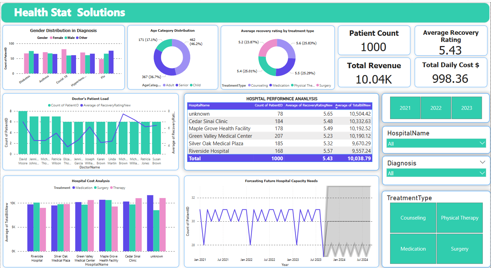

#  HealthStat Solutions - Advancing Healthcare Analysis through Data Insights


## **Project Overview**

This project involves analyzing healthcare datasets to uncover trends that can improve patient outcomes and optimize hospital operations. The objective is to leverage Power BI for a deep dive into the provided healthcare datasets. The task encompasses meticulous data cleaning and sophisticated data modeling, utilizing DAX for advanced analytics. 
The goal is to create a comprehensive, interactive dashboard in Power BI that presents a cohesive narrative of the healthcare data. The dashboard should serve as a tool to uncover and visualize important trends, such as the interplay between patient demographics and treatment outcomes, cost implications of various medical procedures, and overall hospital performance metrics. 
The analysis will provide invaluable insights, aiding healthcare providers in enhancing patient care and operational efficiency, and positioning HealthStat Solutions at the forefront of healthcare analytics.

### **Datasets Used**

1. **Patient Medical Records**
   - Contains information on patient details, diagnoses, treatments, and billing.
2. **Hospital Treatment Details**
   - Provides insights into hospital data, including doctor information, room details, and recovery ratings.

Both datasets were cleaned, merged, and analyzed to provide actionable insights.

---

## **Steps Involved**

### 1. **Data Importing and Cleaning in Power Query Editor**

- Imported the datasets into Power BI.
- Used **Power Query Editor** to clean the data:
  - **Missing Values**:
    - In the `TotalBill` and `RecoveryRating` columns, missing values were replaced with their respective averages:
      - **TotalBill**: Replaced nulls with the **average bill per treatment type**.
      - **RecoveryRating**: Replaced nulls with the **average recovery rating per treatment type**.
    - In the `PatientName` column, filled missing names by concatenating `PatientID` to ensure each entry had a unique identifier.
  - **Date Format Correction**:
    - Corrected the data types for the `AdmissionDate` and `DischargeDate` columns by converting them into proper date formats, facilitating accurate time-based calculations such as length of stay.

### 2. **Challenges Faced in Data Cleaning**

- **Missing Values**:
  - Filling missing data in `TotalBill` and `RecoveryRating` required calculating averages based on treatment type, ensuring data completeness without biasing results.
  - For missing `PatientName`, concatenated `PatientID` to provide unique identifiers while maintaining privacy.
  
- **Date Formatting Issues**:
  - Some entries in `AdmissionDate` and `DischargeDate` had inconsistent formats, which was corrected to ensure accurate date-based analysis, such as calculating patient length of stay.

### 3. **Data Modeling and DAX Implementation**

- **Merging the Datasets**:
  - Used `PatientID` as the key to merge datasets.

- **DAX Calculations**:
  - Created new calculated columns using DAX, including:
    - **Length of Stay**:
      ```DAX
      LengthOfStay = DATEDIFF(PatientMedicalRecords[AdmissionDate], PatientMedicalRecords[DischargeDate], DAY)
      ```
    - **Average Recovery Rating per Treatment**:
      ```DAX
      AvgRecoveryRating = AVERAGE(HospitalTreatmentDetails[RecoveryRating])
      ```
    - **Total Treatment Cost**:
      ```DAX
      TotalTreatmentCost = PatientMedicalRecords[TotalBill] + SUMX(HospitalTreatmentDetails, HospitalTreatmentDetails[DailyCost] * LengthOfStay)
      ```

### 4. **Forecasting with DAX**

- One of the key challenges I faced was forecasting hospital capacity needs for the future. I approached this by learning to implement **forecasting techniques** in Power BI using DAX.
  - **Future Hospital Capacity Needs**:
    - By analyzing historical trends in patient admissions, I was able to forecast hospital bed and staff needs, contributing to operational efficiency.


## **Dashboard Creation**

- Developed an interactive Power BI dashboard that includes:
  - **Key Metrics**: Patient demographics, treatment costs, and recovery ratings.
  - **Hospital Performance**: Visualized hospital performance through recovery ratings, treatment costs, and patient loads.
  - **Forecasting**: Implemented predictions on hospital capacity needs, allowing hospitals to prepare for future patient volumes and optimize resource allocation.

---

## **Conclusion**

This project showcases how **Power BI** can be used to gain valuable insights from healthcare data. Through thorough data cleaning, DAX modeling, and forecasting, the dashboard provides hospitals with the tools they need to improve patient outcomes and optimize operational efficiency.
